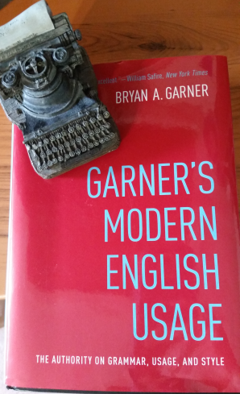

# Roadmap
- Tidyverse philosophy lesson
- Apply functions with `map()`, `modify()`
- Reduce vectors/lists with `reduce()`, `accumulate()`
- Modify functions with `safely()`, `quietly()`, `possibly()`
- Down a rabbit hole with tidy eval
  
::: notes
- We'll focus on `purrr` but I'll use Tidyverse tools along the way.
:::

# Tidyverse Philosophy
<h2>An Impassioned Defense</h2>


::: notes
- Bryan Garner sticking up for what's right.
:::

# Tidyverse Philosophy
<h2>Garner's other work:</h2>


::: notes
- Garner's work is at the heart of a heated debate you probably didn't know existed: 
  - Prescriptivism vs. Descriptivism
  
:::
# Tidyverse Philosophy
<h2>Descriptive vs. Prescriptive Grammar</h2>
<div style="float: left; width: 50%;">
**Descriptive**:

- Rules derived from usage
- All forms of expressions equally valid
- Attempts to be comprehensive

</div>

<div style="float: right; width: 50%;">
**Prescriptive**:

- Rules inform usage
- One correct/best form of expression
- Intentionally constrained

</div>

::: notes
Whatever the merits of each approach, the constraints of a prescriptive paradigm make it useful for beginners in learning a language and/or way of thinking.
:::

# Tidyverse Philosophy
<h2>Why Are We Talking About This?</h2>
- Prescriptivism is **good for beginners**
- Prescriptivism can **outsource cognitive burden**
- Prescriptivism can **train a way of thinking**
- The Tidyverse is prescriptive

::: notes
- The language in which you think determines the thoughts you have.
:::

# Tidyverse Philosophy
<h2>Tidy Opinions</h2>
- The data type returned by a function should be predictable.
- Data object should be first argument in function.
- 

# How I Learned to Stop Worrying and Love the Tidyverse
And you can, too:

- Try it
- Ask why
- Branch out with confidence

::: notes
The Tidyverse is prescriptive, so benefiting from the work that's gone into it means embracing that paradigm, at least conditionally.
:::

# Apply Functions
<h2>Introducing `purrr`</h2>
- A "functional programming toolkit." 
- Built for complex, iterative tasks. 

# Apply functions
<h2>`map()`</h2>
- `map(.x, .f, ...)`
- `.x`: A vector or list
- `.f`: 
  - A function name or formula to apply a function iteratively, or 
  - A vector or list to specify elements to extract from `.x`

# Conventions
Specify functions in three ways:

- Named function
- Write full function definition
- `purrr`-style lambda functions (~)

# Save for later
Data using `babynames` and [`lexicon`](https://github.com/trinker/lexicon). 

```r
babies <- 
  babynames::babynames %>% 
  group_by(sex, first_letter = str_sub(name, 1L, 1L)) %>% 
  top_n(-10, prop) %>% 
  pull(name) %>% 
  sort()

web_slang <- lexicon::hash_internet_slang


cliches <- lexicon::cliches
```

# Named function

```r
map(mtcars, quantile)
```

```
## $mpg
##     0%    25%    50%    75%   100% 
## 10.400 15.425 19.200 22.800 33.900 
## 
## $cyl
##   0%  25%  50%  75% 100% 
##    4    4    6    8    8 
## 
## $disp
##      0%     25%     50%     75%    100% 
##  71.100 120.825 196.300 326.000 472.000 
## 
## $hp
##    0%   25%   50%   75%  100% 
##  52.0  96.5 123.0 180.0 335.0 
## 
## $drat
##    0%   25%   50%   75%  100% 
## 2.760 3.080 3.695 3.920 4.930 
## 
## $wt
##      0%     25%     50%     75%    100% 
## 1.51300 2.58125 3.32500 3.61000 5.42400 
## 
## $qsec
##      0%     25%     50%     75%    100% 
## 14.5000 16.8925 17.7100 18.9000 22.9000 
## 
## $vs
##   0%  25%  50%  75% 100% 
##    0    0    0    1    1 
## 
## $am
##   0%  25%  50%  75% 100% 
##    0    0    0    1    1 
## 
## $gear
##   0%  25%  50%  75% 100% 
##    3    3    4    4    5 
## 
## $carb
##   0%  25%  50%  75% 100% 
##    1    2    2    4    8
```

# Full function definition

```r
map(LETTERS, function(letter){
  chosen_one <- 
    babies %>% 
    str_subset(paste0("^", letter)) %>% 
    sample(1)
  
  cliches_sub <- 
    cliches %>% 
    str_subset(paste0("^(", letter, "|", str_to_lower(letter), ")")) 
  
  cliche <- ifelse(length(cliches_sub), 
                   sample(cliches_sub, 1), 
                   "indescribable")
  
  paste0(str_to_sentence(cliche), ", ", chosen_one, "!")
})
```

```
## [[1]]
## [1] "All talk, no action, Abigeal!"
## 
## [[2]]
## [1] "Big man on campus, Brishaun!"
## 
## [[3]]
## [1] "Cute as a puppy, Caridad!"
## 
## [[4]]
## [1] "Dressed to the nines, Domarion!"
## 
## [[5]]
## [1] "Everything but the kitchen sink, Everado!"
## 
## [[6]]
## [1] "Face the music, Federica!"
## 
## [[7]]
## [1] "Good things come to those who wait, Greenlea!"
## 
## [[8]]
## [1] "High and dry, Hedda!"
## 
## [[9]]
## [1] "In a word, Iesa!"
## 
## [[10]]
## [1] "Jockey for position, Jisell!"
## 
## [[11]]
## [1] "Know him from adam, Kiyona!"
## 
## [[12]]
## [1] "Loose cannon, Lyllyan!"
## 
## [[13]]
## [1] "Moment of truth, Mizuki!"
## 
## [[14]]
## [1] "No guts, no glory, Nalanee!"
## 
## [[15]]
## [1] "On thin ice, Osborne!"
## 
## [[16]]
## [1] "Playing with fire, Paiden!"
## 
## [[17]]
## [1] "Quick as a wink, Quanta!"
## 
## [[18]]
## [1] "Rags to riches, Ritisha!"
## 
## [[19]]
## [1] "Seize the day, Summerrose!"
## 
## [[20]]
## [1] "Take the bait, Tawnee!"
## 
## [[21]]
## [1] "Unvarnished truth, Usher!"
## 
## [[22]]
## [1] "Vain attempt, Vaitea!"
## 
## [[23]]
## [1] "Waiting for the other shoe to drop, Wilberto!"
## 
## [[24]]
## [1] "Indescribable, Xaven!"
## 
## [[25]]
## [1] "Yappy as a dog, Yissachar!"
## 
## [[26]]
## [1] "Indescribable, Zuriya!"
```

# Lambda function
- `~` is shorthand for function(x) {}
- When specifying a function this way, use `.` or `.x` to refer to the 

```r
map(LETTERS, ~ {
  chosen_one <- 
    babies %>% 
    str_subset(paste0("^", .x)) %>% 
    sample(1)
  
  cliches_sub <- 
    cliches %>% 
    str_subset(paste0("^(", .x, "|", str_to_lower(.x), ")")) 
  
  cliche <- ifelse(length(cliches_sub), 
                   sample(cliches_sub, 1), 
                   "Indescribable")
  
  paste0(str_to_sentence(cliche), ", ", chosen_one, "!")
})
```

```
## [[1]]
## [1] "American as apple pie, Azha!"
## 
## [[2]]
## [1] "Big as life, Blessed!"
## 
## [[3]]
## [1] "Cold shoulder, Caterine!"
## 
## [[4]]
## [1] "Don\\'t step on anyone\\'s toes, Dominae!"
## 
## [[5]]
## [1] "Eat your heart out, Evynne!"
## 
## [[6]]
## [1] "Fall by the wayside, Fatima!"
## 
## [[7]]
## [1] "Gets my goat, Gwendolen!"
## 
## [[8]]
## [1] "Hand to mouth, Henya!"
## 
## [[9]]
## [1] "It takes all kinds, Ifra!"
## 
## [[10]]
## [1] "Judge a book by its cover, Jenalynn!"
## 
## [[11]]
## [1] "Kick up your heels, Keyontay!"
## 
## [[12]]
## [1] "Land on your feet, Lonnie!"
## 
## [[13]]
## [1] "Make your blood boil, Madelen!"
## 
## [[14]]
## [1] "Not written in stone, Niyae!"
## 
## [[15]]
## [1] "On the rocks, Osmond!"
## 
## [[16]]
## [1] "Play by the rules, Philipe!"
## 
## [[17]]
## [1] "Quick as a wink, Quantay!"
## 
## [[18]]
## [1] "Red herring, Ronasia!"
## 
## [[19]]
## [1] "Signed, sealed, and delivered, Shardul!"
## 
## [[20]]
## [1] "This day and age, Taylene!"
## 
## [[21]]
## [1] "Until the cows come home, Urie!"
## 
## [[22]]
## [1] "Vanquish the enemy, Vahn!"
## 
## [[23]]
## [1] "Whole nine yards, Woodson!"
## 
## [[24]]
## [1] "Indescribable, Xander!"
## 
## [[25]]
## [1] "You are what you eat, Yamillet!"
## 
## [[26]]
## [1] "Indescribable, Zaela!"
```


# Map2


